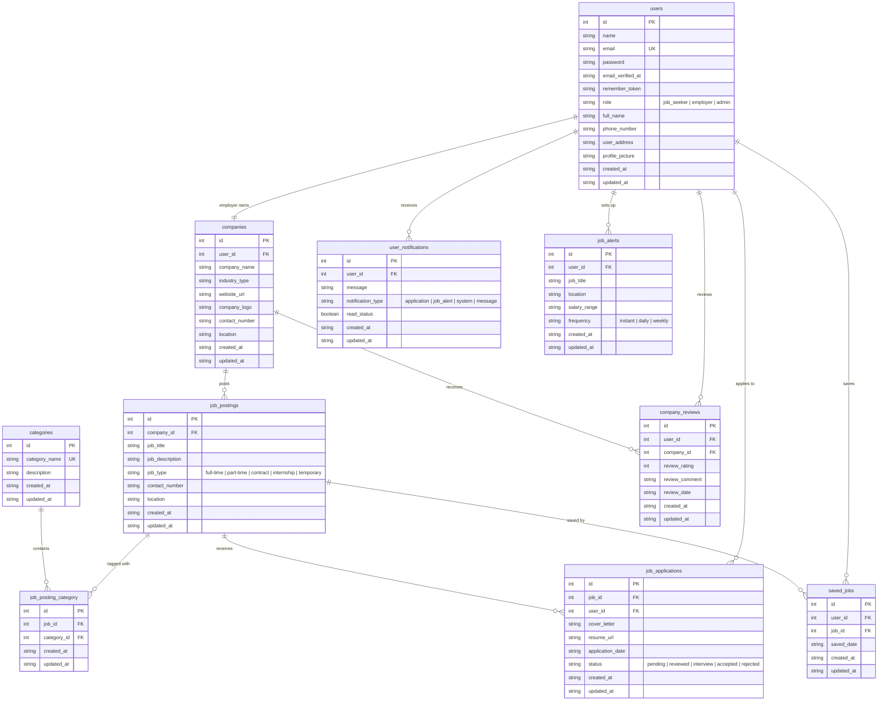

# Job Seeker - Entity Relationship Diagram (ERD)

## Mermaid ERD



## Relationship Legend

```
||--||    = One to One       (one user has one company)
||--o{    = One to Many      (one company has many job postings)
}o--o{    = Many to Many     (job postings <-> categories via pivot table)
```

## Relationships Breakdown

| Parent Table   | Child Table             | Relationship | Meaning                                    |
|----------------|-------------------------|--------------|---------------------------------------------|
| users          | companies               | One-to-One   | One employer owns one company               |
| users          | job_applications        | One-to-Many  | One user can apply to many jobs             |
| users          | saved_jobs              | One-to-Many  | One user can save many jobs                 |
| users          | company_reviews         | One-to-Many  | One user can review many companies          |
| users          | user_notifications      | One-to-Many  | One user can have many notifications        |
| users          | job_alerts              | One-to-Many  | One user can set up many alerts             |
| companies      | job_postings            | One-to-Many  | One company posts many jobs                 |
| companies      | company_reviews         | One-to-Many  | One company receives many reviews           |
| job_postings   | job_posting_category    | One-to-Many  | One job can have many categories            |
| job_postings   | job_applications        | One-to-Many  | One job receives many applications          |
| job_postings   | saved_jobs              | One-to-Many  | One job can be saved by many users          |
| categories     | job_posting_category    | One-to-Many  | One category contains many jobs             |

---

## Understanding the down() Method in Migrations

### What Is up() and down()?

Every migration file has two methods:

```php
public function up(): void     // ← FORWARD  — applies changes
public function down(): void   // ← REVERSE  — undoes changes
```

Think of it like this:
- `up()` = doing something
- `down()` = undoing that same thing

### Why Does down() Exist?

`down()` exists so you can **rollback** (undo) migrations if you make a mistake.

Laravel migrations work like **version control for your database**, just like Git does for your code.

```
php artisan migrate          ← runs up()   → applies changes
php artisan migrate:rollback ← runs down() → undoes changes
```

### Two Types of down()

---

#### Type 1: Table Was Created → down() Drops the Table

When `up()` creates a new table, `down()` deletes (drops) the whole table.

**Example: create_companies_table.php**

```php
// up() creates the table
public function up(): void
{
    Schema::create('companies', function (Blueprint $table) {
        $table->id();
        $table->string('company_name');
        // ...
    });
}

// down() deletes the table entirely
public function down(): void
{
    Schema::dropIfExists('companies');   // ← drops the whole table
}
```

**What happens:**
```
php artisan migrate          → companies table is CREATED
php artisan migrate:rollback → companies table is DELETED
```

---

#### Type 2: Columns Were Added → down() Removes Those Columns

When `up()` adds columns to an existing table, `down()` removes only those columns.

**Example: add_additional_fields_to_users_table.php**

```php
// up() adds new columns to the users table
public function up(): void
{
    Schema::table('users', function (Blueprint $table) {
        $table->string('full_name')->nullable();
        $table->string('phone_number')->nullable();
        $table->text('user_address')->nullable();
        $table->string('profile_picture')->nullable();
    });
}

// down() removes only those same columns
public function down(): void
{
    Schema::table('users', function (Blueprint $table) {
        $table->dropColumn(['full_name', 'phone_number', 'user_address', 'profile_picture']);
    });
}
```

**What happens:**
```
php artisan migrate          → full_name, phone_number, user_address, profile_picture are ADDED
php artisan migrate:rollback → full_name, phone_number, user_address, profile_picture are REMOVED
```

The users table itself stays — only the new columns are removed.

---

### All Your Migrations Explained

| Migration File                                | up() Does                            | down() Does                              |
|-----------------------------------------------|--------------------------------------|------------------------------------------|
| 0001_01_01_000000_create_users_table          | Creates users table                  | Drops users table                        |
| 2026_02_03_154724_add_additional_fields...    | Adds 4 columns to users              | Removes those 4 columns from users       |
| 2026_02_03_155154_create_companies_table      | Creates companies table              | Drops companies table                    |
| 2026_02_03_155301_create_categories_table     | Creates categories table             | Drops categories table                   |
| 2026_02_03_155355_create_job_postings_table   | Creates job_postings table           | Drops job_postings table                 |
| 2026_02_03_160513_create_job_posting_cat...   | Creates job_posting_category table   | Drops job_posting_category table         |
| 2026_02_03_160726_create_job_applications...  | Creates job_applications table       | Drops job_applications table             |
| 2026_02_03_160809_create_saved_jobs_table     | Creates saved_jobs table             | Drops saved_jobs table                   |
| 2026_02_03_160839_create_company_reviews...   | Creates company_reviews table        | Drops company_reviews table              |
| 2026_02_03_160908_create_user_notifications.. | Creates user_notifications table     | Drops user_notifications table           |
| 2026_02_03_160929_create_job_alerts_table     | Creates job_alerts table             | Drops job_alerts table                   |
| 2026_02_03_162148_add_role_to_users_table     | Adds role column to users            | Removes role column from users           |

---

### When Would You Use Rollback?

**Scenario 1:** You made a mistake in your migration

```bash
# You ran migrations and something is wrong
php artisan migrate:rollback        # ← undoes the LAST migration only

# Fix the migration file

# Run it again
php artisan migrate
```

**Scenario 2:** You want to undo multiple migrations

```bash
php artisan migrate:rollback --step=3   # ← undoes the last 3 migrations
```

**Scenario 3:** You want to start fresh (during development)

```bash
php artisan migrate:fresh               # ← drops ALL tables and re-runs all migrations
```

---

### Key Takeaway

- `up()` and `down()` must be **opposites** of each other
- If `up()` creates → `down()` drops
- If `up()` adds columns → `down()` removes those same columns
- `down()` is your safety net — it lets you undo mistakes
